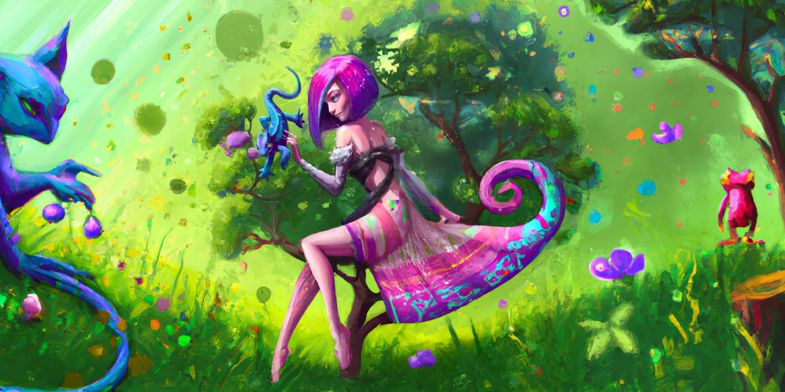
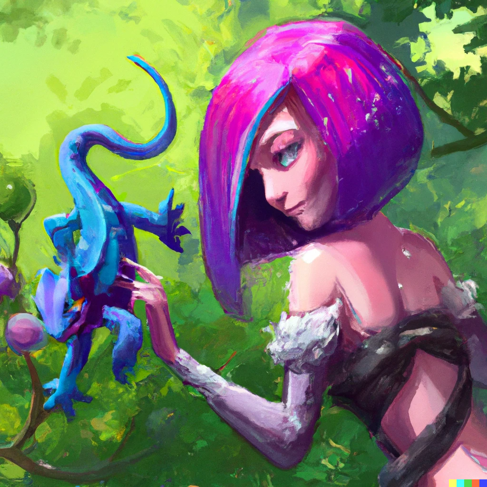

# Lol-Champions

  
  
<h2><b>Présentation</b></h2>
  
Lol-Champions est un aggrégateur de donnée qui rassemble des données d'un maximum de sources en FR.
L'objectif de l'application web qui fournit des informations détaillées sur les champions du jeu League of Legends.

 

## Données récupérés

Différents sites ou API permettent la récupération de données.

- Data Dragons
  - Liste des champions
  - Affichage des statistiques et des compétences de chaque champion.
  - Visualisation des différentes apparences (skins) disponibles pour chaque champion.

 

## Comment ça fonctionne

L'application est développée en utilisant les technologies suivantes :

- Angular & Ionic : Framework JavaScript pour la construction de l'interface utilisateur.
- HTML / CSS / TypeScript : Langages de programmation utilisés pour le développement.
